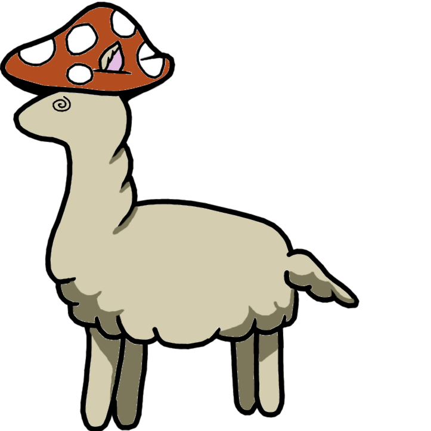

### Welcome to CHOMPS 2025 Shared Task — SHROOM-CAP, the Shared-task on Hallucinations and Related Observable Overgeneration Mistakes in Crosslingual Analyses of Publications 

<!-- TM: somehow jrvc elected to add a white-on-white title?
###  Welcome to CHOMPS 2025 Shared Task — SHROOM-CAP, the Shared-task on Hallucinations and Related Observable Overgeneration Mistakes in Crosslingual Analyses of Publications  
-->

#### ** NEW ** 

[Oct 10th] **Make sure to use updated HI ML TE BN test data files!!!!!** 

[Oct 5th] **TEST SET IS OUT!!!!!** 

**Submission Platform**: Participants will be able to submit their solutions and see the leaderboard on this platform : [https://shroomcap.pythonanywhere.com/](https://shroomcap.pythonanywhere.com/). Go register now !!!

---

Welcome to the official shared task website for SHROOM-CAP, a [CHOMPS 2025](https://chomps2025.github.io/) shared task!

SHROOM-CAP stands for "**S**hared-task on **H**allucinations and **R**elated **O**bservable **O**vergeneration **M**istakes in **C**rosslingual **A**nalyses of **P**ublications".
SHROOM-CAP will invite participants to detect hallucination in the outputs of LLMs in a scientific context. 
This shared task extends our previous iteration, SHROOM, with a few key changes: 
- We focus on LLM outputs for scientific domain;
- We're looking at crosslingual setting with both high-resource languages such as, English, Spanish, French, Hindi and suprisal low-level languages;
- Participants will have to detect if hallucination occurs or not.

_The information on this website is subject to change._ 
We will send announcements for any major update on the [Google group mailing list](https://groups.google.com/g/shroomcap).

#### What is SHROOM-CAP?
The task consists of detecting presence of scientific hallucinations. 
Participants are asked to determine if a given scientific text produced by LLMs constitute hallucinations.
The task is held in a cross-lingual setting, i.e., we provide data in multiple mixed languages produced by a variety of public-weights LLMs.´

In practice, we provide an LLM output (as a string of characters, a list of tokens, and a list of logits), and participants have to predict if the LLM output string contains a hallucination (binary classification).

Participants are free to use any approach they deem appropriate, including using external resources, and work on any subset of languages they are interested in.

#### How will participants be evaluated?
Participants will be evaluated for performing binary classification to identify cases of scientific hallucinations. This will be done using via macro-F1 score for two criterions:
(i) Factual Mistakes and (ii) Fluency Mistakes

Rankings and submissions will be done separately per language.

#### Participant info
To participate, the participants need to register via [https://forms.gle/hWR9jwTBjZQmFKAE7](https://forms.gle/hWR9jwTBjZQmFKAE7). This form will enable us add the participants on the google group for further communication.

#### Data
Below are links to access the data already released, as well as provisional expected release dates for future splits.
Do note that release dates are subject to change.

| Dataset split | Access | Description |
|---|---|---|
|**Train Set v1**|<a href="https://drive.google.com/drive/folders/1j48BBPd7hDyZ8h2bt1mDmzZRGcLKijEa?usp=sharing" download>download</a> (train1)|Contains languages: `en, hi, es, fr, it`|
|**Sample Testing data**|<a href="https://drive.google.com/drive/folders/1wxgrciTrM0d0N1Fxn6vKHdlYm2tpYVeK?usp=sharing" download>download</a> (test-sample)| Contains format of sample test set|
|**Validation Set**|<a href="https://drive.google.com/drive/folders/1Bh4V-ZE9Q8dlzEE3SqYJwC7TMy5KOmKk?usp=drive_link" download>download</a> (validation)|Contains languages: `en, hi, es, fr, it`|
|**Train Set v2**|<a href="https://drive.google.com/drive/u/0/folders/1d5Ypzs0LFio7OK219OgOp5TsOMuVoA9h" download>download</a>  (train2)|Contains languages: `en, hi, es, fr, it`|
|** **Test Set** ** |<a href="https://drive.google.com/drive/folders/1bsfvjdLSC0J2aCVWrg68S9bruKTrwKof?usp=sharing" download>download</a> (unlabled test)|Contains languages: `en, hi, es, fr, it` IndicLanguage : `bn, te, ml, gu`|

#### Important dates

This information is subject to change.
- ~~Starter Release – July 28~~
- ~~Training Phase July 28 – October 5, 2025~~
- Testing Phase October 5 – ~~October 15, 2025~~ October 16, 2025
- Paper Submission Deadline October 25, 2025
- Notification of Acceptance November 3, 2025
- Camera-ready Due November 11, 2025
- Proceedings Due December 1, 2025
- CHOMPS workshop: 23/24 December 2025 (co-located with AACL 2025)

#### Organizers of the shared task

- [Aman Sinha](https://amansinha09.github.io/),
Université de Lorraine, France
- [Federica Gamba](https://ufal.mff.cuni.cz/federica-gamba), 
Charles University, Prague
- [Raúl Vázquez](https://jrvc.github.io/), 
University of Helsinki, Finland
- [Timothee Mickus](https://timotheemickus.github.io/), 
University of Helsinki, Finland
- [Laura Zanella](https://scholar.google.com/citations?user=NUhkHp_VrJMC&hl=es), 
Independent Researcher
- [Ahana Chattopadhyay](https://ahanachattopadhyay.github.io/), Orange Research, France
- [Yash Kankanampati](https://scholar.google.com/citations?user=m6rHMc0AAAAJ&hl=fr), Université Sorbonne Paris Nord, France
- [Binesh Arakkal Remesh](https://in.linkedin.com/in/binesh-arakkal-remesh-15497a288), Université de Lorraine, France
- [Aryan Chandramania](https://in.linkedin.com/in/aryan-chandramania ), IIIT Hyderabad, India

#### Looking for something else?

The websites for all the iterations of the shared task are available here: 
- [Mu-SHROOM: Semeval-2025 Task3](./2025.md)
- [SHROOM: Semeval-2024 Task 6](./2024.md).
 

