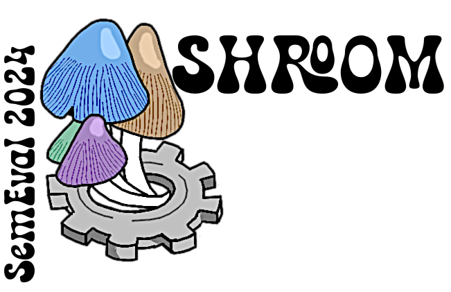

# Welcome to the *SHROOM Shared-Task Series on Hallucinations and Related Observable Overgeneration Mistakes
The SHROOM shared task series brings together researchers and practitioners interested in detecting hallucinations — that is, fluent yet semantically incorrect or unsupported outputs — in natural language generation (NLG) systems. Since 2024, we've been pushing the boundaries of automatic hallucination detection, with each edition introducing new challenges and innovations.

This website serves as a central hub to explore the current and past editions of the shared task, including SHROOM (2024), Mu-SHROOM (2025), and the upcoming ν-SHROOM (2026).

---
## 🍄🤪🌀 SHROOM 2024

**SHROOM** – the original Shared-task on Hallucinations and Related Observable Overgeneration Mistakes – kicked off the initiative at [SemEval-2024](https://semeval.github.io/SemEval2024/). Participants were asked to identify hallucinated content in NLG outputs across several generation tasks (e.g., machine translation, paraphrasing, definition modeling), both with and without access to the model that generated the outputs.

🔗 [Go to the SHROOM 2024 website](/shroom/2024)

---
##  🌈😜🍄 Mu-SHROOM 2025

**Mu-SHROOM** is the second edition of the shared task, held at [SemEval-2025](https://semeval.github.io/SemEval2025/). This multilingual extension of SHROOM expands the scope to 14 languages and shifts the focus to instruction-tuned large language models (LLMs). This time, the task targets hallucination **spans** at the character level — asking participants to predict where hallucinations occur and how likely they are.

Mu-SHROOM brings together multilingual evaluation, character-level scoring, and a diverse set of public-weight LLMs, making it a challenging and rich task for researchers in hallucination detection and robust NLG.

🔗 [Explore Mu-SHROOM 2025](/shroom/2025)

---
## 🔮🍄👁‍🗨 ν-SHROOM 2026 (coming soon! TBC)
Get ready for the next iteration of the SHROOM series — **ν-SHROOM** (pronounced "nu-shroom" or "vi-shroom", interchangeably), coming in **2026**! Building on insights from SHROOM and Mu-SHROOM, ν-SHROOM will introduce new dimensions to the hallucination detection landscape.

Stay tuned — more details will be announced later in 2025.

---

## 👥🙌🌐 Join the SHROOM Community 

Whether you're interested in joining the next round, learning from past editions, or just staying informed about hallucination detection in NLG, we'd love to have you in the community.

- Join the conversation on [Slack](https://join.slack.com/t/shroom-shared-task/shared_invite/zt-2mmn4i8h2-HvRBdK5f4550YHydj5lpnA)
- Check out the past editions Google gorups
  - [Mu-SHROOM 2025](https://groups.google.com/g/semeval-2025-task-3-mu-shroom)
  - [Mu-SHROOM 2024](https://groups.google.com/g/semeval-2024-task-6-shroom)

---

### 🧪 Want to dive straight in? 
Visit one of the task pages above and start exploring data, baselines, and results.

Reach out if you have further questions, collaboration ideas or simply want to say hi:
- [Timothee Mickus](https://timotheemickus.github.io/), 
University of Helsinki, Finland
- [Raúl Vázquez](https://jrvc.github.io/), 
University of Helsinki, Finland
