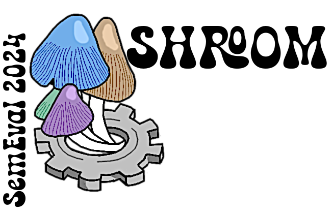
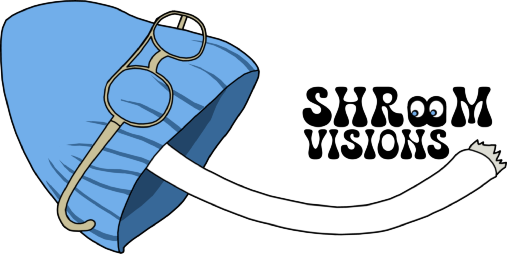

# Welcome to the *SHROOM Shared-Task Series on Hallucinations and Related Observable Overgeneration Mistakes
The SHROOM shared task series brings together researchers and practitioners interested in detecting hallucinations — that is, fluent yet semantically incorrect or unsupported outputs — in natural language generation (NLG) systems. Since 2024, we've been pushing the boundaries of automatic hallucination detection, with each edition introducing new challenges and innovations.

This website serves as a central hub to explore the current and past editions of the shared task, including SHROOM (2024), Mu-SHROOM (2025), and the upcoming ν-SHROOM (2026).

--- 

## Explore the tasks

### [SHROOM 2024](/shroom/2024)

**SHROOM** is the OG Shared-task on Hallucinations and Related Observable Overgeneration Mistakes. We kicked off the initiative at [SemEval-2024](https://semeval.github.io/SemEval2024/). Participants were asked to identify hallucinated content in NLG outputs across several generation tasks (e.g., machine translation, paraphrasing, definition modeling), both with and without access to the model that generated the outputs.

🔗 [Go to the SHROOM 2024 website](/shroom/2024)

---

### [Mu-SHROOM 2025](/shroom/2025)

**Mu-SHROOM** is the second edition of the shared task, held at [SemEval-2025](https://semeval.github.io/SemEval2025/). This multilingual extension of SHROOM expands the scope to 14 languages and shifts the focus to instruction-tuned large language models (LLMs). This time, the task targets hallucination **spans** at the character level.

🔗 [Explore Mu-SHROOM 2025](/shroom/2025)

---

### [SHROOM-CAP Shared Task 2025](/shroom/2025a)

**SHROOM-CAP** is the third edition of the shared task, held at [CHOMPS-2025](https://chomps2025.github.io/). This cross-lingual extension of SHROOM expands the scope to high and low resource languages with the special focus to indic languages. This time, the task targets hallucination in scientific domain — asking participants to predict if there is scienific hallucinations or not and how likely they are.

🔗 [Explore SHROOM-CAP Shared Task](/shroom/2025a)

---

### [SHROOM-visions 2026](/shroom/2026)

**Shroom-visions** is the fourth iteration of the SHROOM series, hosted at the [UncertainLP Workshop](https://uncertainlp.github.io/) (co-located with EMNLP 2026). This edition tackles hallucinations in vision-language models. 

With it we provide a dataset for hallucination detection in image-conditioned text generation (VQA, image captioning, etc.). and a a four-class taxonomy for hallucinaiton occurences in a multilingual setup (Chinese, English, French, Italian).

🔗 [Explore Shroom-visions 2026](/shroom/2026)

---

## 👥🙌🌐 Join the SHROOM Community 

Whether you're interested in joining the next round, learning from past editions, or just staying informed about hallucination detection in NLG, we'd love to have you in the community.

- Join the conversation on [Slack](https://join.slack.com/t/shroom-shared-task/shared_invite/zt-2mmn4i8h2-HvRBdK5f4550YHydj5lpnA)
- Check out the past editions Google gorups
  - [SHROOM-visions 2026](https://groups.google.com/g/shroom-visions-2026)
  - [SHROOM-CAP 2025](https://groups.google.com/g/shroomcap) 
  - [Mu-SHROOM 2025](https://groups.google.com/g/semeval-2025-task-3-mu-shroom)
  - [Mu-SHROOM 2024](https://groups.google.com/g/semeval-2024-task-6-shroom)

---

### 🧪 Want to dive straight in? 
Visit one of the task pages above and start exploring data, baselines, and results.

Reach out if you have further questions, collaboration ideas or simply want to say hi:
- [Timothee Mickus](https://timotheemickus.github.io/), 
University of Helsinki, Finland
- [Raúl Vázquez](https://jrvc.github.io/), 
University of Helsinki, Finland
